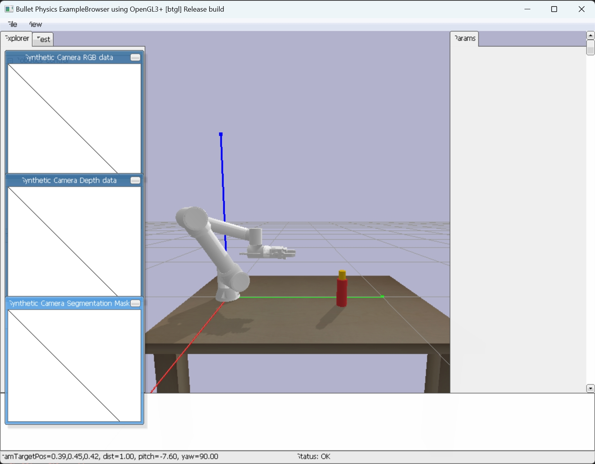

<!--
 * @Author: wangziyuan 13536655301
 * @Date: 2024-04-10 21:59:04
 * @LastEditors: wangziyuan 13536655301
 * @LastEditTime: 2024-04-22 20:41:18
 * @FilePath: \RL_FR5\FR5_Reinforcement-learning\README.md
 * @Description: 这是默认设置,请设置`customMade`, 打开koroFileHeader查看配置 进行设置: https://github.com/OBKoro1/koro1FileHeader/wiki/%E9%85%8D%E7%BD%AE
-->
# FR_Reinforcement learning
中文版跳转   [中文版Readme](README_cn.md)
## Introduction
This project is a reinforcement learning training code for grasping with the FAIRINO FR5 robotic arm, based on pybullet and stable baseline3.

For the video, please refer to Bilibili (please like, share, and subscribe!) 
视频详见b站（大家多多一键三连~）【机械臂强化学习抓取】 
https://www.bilibili.com/video/BV1DD421V7eP/?share_source=copy_web&vd_source=c17cbd34d977b7117b060596fe15e749
## I. Hardware Overview
Training hardware: NVIDIA GeForce 3090 graphics processor and Intel(R) Core(TM) i9-10900X CPU @ 3.70GHz.
Deployment hardware and software: NVIDIA GeForce RTX 3070 graphics processor and 11th Gen Intel(R) Core(TM) i7-11800H @ 2.30GHz, using Ubuntu 20.04 with ROS Noetic.

## II.Scene Deployment Instructions
The FAIRINO FR5 is a high-precision industrial six-axis robotic arm with a repeatability of 0.02mm. We have added a two-finger gripper PGI-140-80 from DH Robotics to the end of the arm, which can achieve an effective stroke of 80mm and a maximum gripping force of 140N. In this experiment, we use pybullet as the simulation platform. The robotic arm will use its gripper to grasp a coffee cup placed in an 80x40x20cm space in front of it parallel to the ground. If the distance between the center of the gripper and the center of the cup is less than 1.5cm, it is judged as a successful grasp. If the robotic arm encounters: 1) the gripper touches the cup or table during motion, 2) the number of motion steps exceeds the limit, then it is judged as task failure. In both simulation and real scenarios, after each experiment, we will randomly reposition the cup.



## III. Requirments
gym==0.26.2

pybullet

opencv-python

loguru

stable_baselines3

scipy

numpy

## IV. Code Explanation
- fr5_description: Stores the URDF model files of the robotic arm.
- Fr5_env.py: Constructs the reinforcement learning environment.
- Fr5_train.py: Contains the reinforcement learning training code.
- FR5_test.py: Used for reinforcement learning testing.
## 五、How to use
Available algorithms：
- PPO（default）
- A2C
- DDPG
- TD3

Start training:
```python
python Fr5_train.py --timesteps 30000 --gui False
```
Visualize training results with TensorBoard:

```
tensorboard --logdir .../logs/PPO/your_training_results --port 6006
```
Infer the model:
```
python Fr5_test.py --model_path your_model_dir --gui True
```