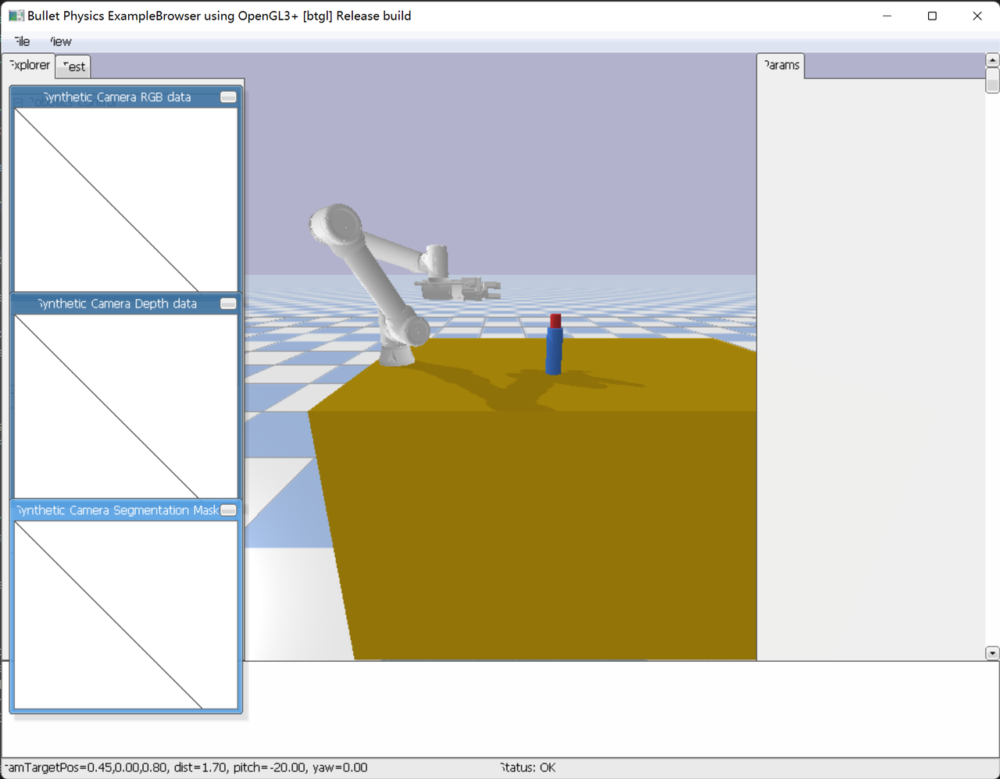
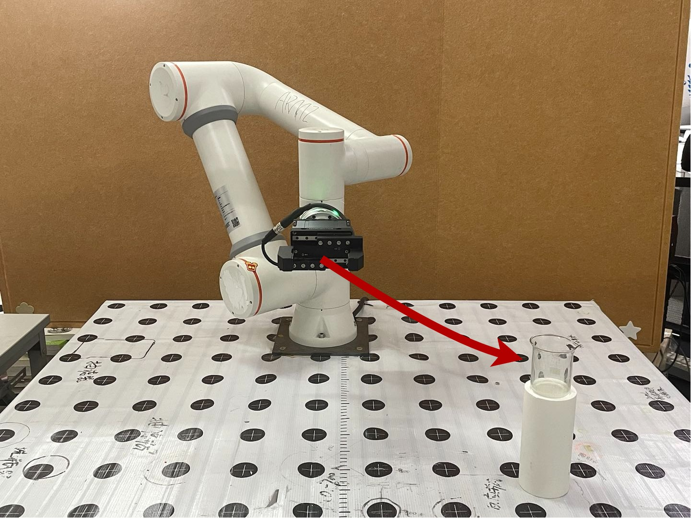

# FR_Reinforcement learning

## 介绍
本项目是基于pybullet和stable baseline3 的法奥机械臂的强化学习抓取训练代码


视频详见b站（大家多多一键三连~）【机械臂强化学习抓取】 
https://www.bilibili.com/video/BV1DD421V7eP/?share_source=copy_web&vd_source=c17cbd34d977b7117b060596fe15e749
## 一、安装机器简介
训练的硬件：NVIDIA GeForce 3090图形处理器和Intel(R) Core(TM) i9-10900X CPU @ 3.70GHz
部署硬件及软件：NVIDIA GeForce RTX 3070图形处理器和11th Gen Intel(R) Core(TM) i7-11800H @ 2.30GHz，使用系统为Ubuntu 20.04+ROS Noetic

## 二、场景部署说明
FAIRINO FR5 是一个高精度的工业六轴机械臂，它的重复定位进度达到了0.02mm，我们在机械臂的末端添加了来自DH Robotics 的二指夹爪PGI-140-80，它可以达到拥有80mm的有效行程和最高140N的抓力。在这个实验中，我们使用的仿真平台是pybullet，机械臂会使用它的夹爪对放置在前方80*40*20cm的空间内的咖啡杯进行平行于地面的抓取，如果夹爪中心距离和杯子的中心点距离小于1.5cm，则判断为抓取成功。如果机械臂出现：1）运动过程中夹爪碰到杯子或者桌子 2）运动步数超过限制，那么这判断为任务失败。在仿真和实际场景中，在每一次实验完成后，我们会对杯子的位置进行随机重新放置。



## 三、requirments 必须的安装包
gym==0.26.2

pybullet

opencv-python

loguru

stable_baselines3

scipy

numpy

## 四、代码说明
fr5_description
用于储存机械臂urdf模型文件
Fr5_env.py
用于构建强化学习环境
Fr5_train.py
强化学习训练代码
FR5_test.py
用于强化学习测试
## 五、How to use
可使用的算法：
- PPO（默认）
- A2C
- DDPG
- TD3

 开始训练：
```python
python Fr5_train.py --timesteps 30000 --gui False
```
tensorboard可视化训练结果

```
tensorboard --logdir .../logs/PPO/你的训练结果 --port 6006
```
推理模型
```
python Fr5_test.py --model_path your_model_dir --gui True
```
